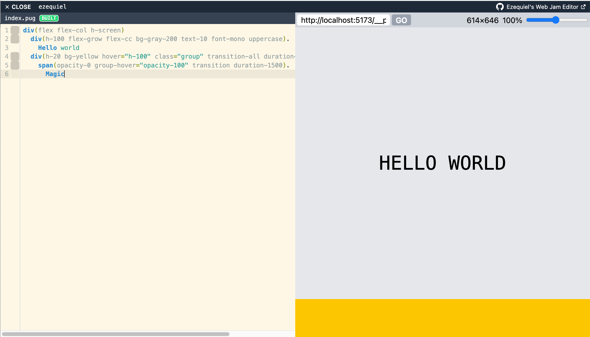

# Web Jam Editor

A small, inspectable, browser-native web-making environment that helps ordinary people create real websites without either becoming developers or surrendering the creation process to a black-box website generator.



## Purpose

And there are really **three overlapping purposes**.

### 1. A personal technology laboratory

I'm using the project to explore:

* what Pug can become when pushed beyond its conventional use;
* what a browser can do as a development environment;
* filesystem abstractions;
* browser-native compilation and transformation;
* virtual web servers;
* Service Workers;
* media processing;
* eventually perhaps AI-assisted workflows.

**Experimentation is part of its legitimate purpose.**

### 2. A tool for people who want to make a website

The person using it shouldn't need to acquire the conceptual machinery of modern web development just to make a website.

Someone uploads an image → it becomes an asset in their project → the tool can show it → optimize it → produce appropriate WebP variants → make it available to the website.

That's very different from:

> “Here's a file browser. Good luck.”

The environment gradually provides **just enough affordance around the raw web technologies to make them usable**.

And importantly, you're not trying to hide the underlying web.

That's the distinction from the black-box visual website builder:

**the system can make the web easier without making the web invisible.**

That has a strong educational consequence.

### 3. A community resource

This is not necessarily a SaaS product.

I'm experimenting with a thing that could become **infrastructure for a community**.

## Technical

Pug-based coding space,
atomic CSS (using UnoCSS with Tailwind preset and attributify enabled)
that runs entirely on the browser.

Works directly with your local filesystem, and builds output to `/www`.

Uses a Service-Worker for live previews that can even run o a separate tab without needing to run
anything on your computer.

## Development

To install dependencies:

```bash
bun install
```

To run:

```bash
bun start
```